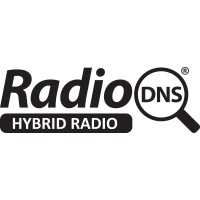

# radio-dns

Simple client du protocole `radio-dns`



## Usage

```bash
./rdns.php --ecc E1 --mode FM --frequency 102.3 --pi F21D
```

```bash
./rdns.php --ecc E1 --mode DAB --ensemble-id F038 --service-id F21D
```

xmlUrl     : http://10230.f21d.fe1.fm.radiodns.org/radiodns/spi/3.1/SI.xml
shortName  : OUI FM
mediumName : OUI FM
logoUrls   :
 -  () 0x0
 - https://ns3132037.ip-51-75-242.eu/radiodns-vzr/data/512_logo32_da768096-a4e1-4471-b291-ab27418d5429.png (image/png) 32x32
 - https://ns3132037.ip-51-75-242.eu/radiodns-vzr/data/512_logo112_b8457c7e-760f-49b5-a590-1c527d2e0e08.png (image/png) 112x32
 - https://ns3132037.ip-51-75-242.eu/radiodns-vzr/data/512_logo128_276f1f55-69ab-4003-9c23-d9ec7f9ca530.png (image/png) 128x128
 - https://ns3132037.ip-51-75-242.eu/radiodns-vzr/data/512_logo320_f91cd1b8-895b-4d22-a363-f36b5468d552.png (image/png) 320x240
 - https://ns3132037.ip-51-75-242.eu/radiodns-vzr/data/512_logo600_836546e5-edef-413e-b158-84716ae8f145.png (image/png) 600x600
bearers    :
 - fm:fe1.f21d.09460 cost=1
 - fm:fe1.f21d.10030 cost=1
 - fm:fe1.f21d.09010 cost=1
 - fm:fe1.f21d.10500 cost=1
 - fm:fe1.f21d.09050 cost=1
 - fm:fe1.f21d.10480 cost=1
 - fm:fe1.f21d.10280 cost=1
 - fm:fe1.f21d.09690 cost=1
 - fm:fe1.f21d.10350 cost=1
 - fm:fe1.f21d.09290 cost=1
 - fm:fe1.f21d.10210 cost=1
 - fm:fe1.f21d.09070 cost=1
 - fm:fe1.f21d.10210 cost=1
 - fm:fe1.f21d.09070 cost=1
 - fm:fe1.f21d.10290 cost=1
 - fm:fe1.f21d.08840 cost=1
 - fm:fe1.f21d.08760 cost=1
 - fm:fe1.f21d.10290 cost=1
 - fm:fe1.f21d.08760 cost=1
 - fm:fe1.f21d.09270 cost=1
 - fm:fe1.f21d.10210 cost=1
 - fm:fe1.f21d.09710 cost=1
 - fm:fe1.f21d.10230 cost=1
 - fm:fe1.f21d.09150 cost=1
 - fm:fe1.f21d.10690 cost=1
 - fm:fe1.f21d.10650 cost=1
 - fm:fe1.f21d.08840 cost=1
 - fm:fe1.f21d.10630 cost=1
 - fm:fe1.f21d.09780 cost=1
 - dab:fe1.f045.f21d.0 cost=2
 - dab:fe1.f00a.f21d.0 cost=2
 - dab:fe1.f058.f21d.0 cost=2
 - dab:fe1.f050.f21d.0 cost=2
 - dab:fe1.f032.f21d.0 cost=2
 - dab:fe1.f022.f21d.0 cost=2
 - dab:fe1.f039.f21d.0 cost=2
 - dab:fe1.f049.f21d.0 cost=2
 - dab:fe1.f04e.f21d.0 cost=2
 - dab:fe1.f014.f21d.0 cost=2
 - dab:fe1.f01b.f21d.0 cost=2
 - dab:fe1.f002.f21d.0 cost=2
 - dab:fe1.f065.f21d.0 cost=2
 - dab:fe1.f022.f21d.0 cost=2
 - dab:fe1.f067.f21d.0 cost=2
 - dab:fe1.f02c.f21d.0 cost=2
 - dab:fe1.f007.f21d.0 cost=2
 - dab:fe1.f052.f21d.0 cost=2
 - dab:fe1.f038.f21d.0 cost=2
 - dab:fe1.f059.f21d.0 cost=2
 - dab:fe1.f054.f21d.0 cost=2
 - dab:fe1.f069.f21d.0 cost=2
 - dab:fe1.f028.f21d.0 cost=2
 - dab:fe1.f04b.f21d.0 cost=2
 - dab:fe1.f022.f21d.0 cost=2
 - dab:fe1.f042.f21d.0 cost=2
 - dab:fe1.f035.f21d.0 cost=2
 - dab:fe1.f056.f21d.0 cost=2
 - http://ouifm.ice.infomaniak.ch/ouifm-high.mp3 cost=3
```


## Couverture

Toutes les radios françaises ne sont pas inscrites à ce programme.

À ce jour j'ai eu des résultats concluants pour :

| Nom       | Mode | Fréquence | Pi   |
| --------- | ---- | --------- | ---- |
| OÜI FM    | FM   |     102.3 | F21D |
| NOSTALGIE | FM   |      90.4 | F218 |
| CHERIE    | FM   |      91.3 | F224 |
| RIRE      | FM   |      97.4 | F226 |
| NRJ       | FM   |     100.3 | F220 |

| Nom       | Mode | EnsembleId | ServiceId |
| --------- | ---- | ---------- | --------- |
| OÜI FM    | DAB  | F038       | F21D      |

## Ressources

- https://radiodns.org/campaigns/project-logo/walkthrough-finding-radio-station-logos/
- https://www.etsi.org/deliver/etsi_ts/103200_103299/103270/01.04.01_60/ts_103270v010401p.pdf
- https://www.etsi.org/deliver/etsi_ts/102800_102899/102818/03.05.01_60/ts_102818v030501p.pdf
- https://www.etsi.org/deliver/etsi_ts/101400_101499/101499/03.02.01_60/ts_101499v030201p.pdf
